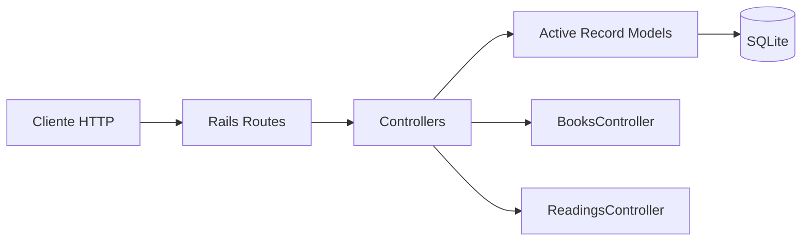

# Book Reader API

API REST para gerenciamento de livros e acompanhamento de leituras, desenvolvida com Ruby on Rails.

## Visão geral

O projeto expõe recursos para cadastrar e consultar livros, registrar leituras e obter filtros específicos, como livros por categoria, autor, tamanho e status de leitura.

## Tecnologias

- Ruby 3.4.9
- Ruby on Rails 8.1.3
- SQLite
- Puma
- Active Record
- Solid Cache / Solid Queue / Solid Cable
- RuboCop
- Brakeman
- Bundler Audit
- Docker
- Kamal / Thruster para deploy

## Arquitetura



A aplicação segue a arquitetura MVC do Rails:

- `config/routes.rb`: definição das rotas HTTP.
- `app/controllers`: camada responsável por receber requisições e retornar respostas.
- `app/models`: regras e persistência das entidades `Book` e `Reading`.
- `db`: migrations, schema e banco SQLite.
- `config`: configuração do Rails e ambientes.
- `.kamal`: configuração para deploy com Kamal.

## Estrutura principal

```text
book-reader-api/
├── app/
│   ├── controllers/
│   │   ├── books_controller.rb
│   │   └── readings_controller.rb
│   └── models/
│       ├── book.rb
│       └── reading.rb
├── config/
│   └── routes.rb
├── db/
├── Dockerfile
├── Gemfile
└── .ruby-version
```

## Requisitos

Para execução local:

- Ruby `3.4.9`
- Bundler
- SQLite 3

Confira a versão do Ruby:

```bash
ruby --version
```

## Como rodar localmente

Clone o projeto:

```bash
git clone https://github.com/juankurtzzz/book-reader-api.git
cd book-reader-api
```

Instale as dependências:

```bash
bundle install
```

Prepare o banco de dados:

```bash
bin/rails db:prepare
```

Inicie o servidor:

```bash
bin/rails server
```

Por padrão, a API ficará disponível em:

```text
http://localhost:3000
```

## Endpoints

### Health check

```http
GET /up
```

### Books

```http
GET    /books
GET    /books/:id
POST   /books
PATCH  /books/:id
PUT    /books/:id
DELETE /books/:id
```

Filtros adicionais:

```http
GET /books/search
GET /books/categories
GET /books/authors
GET /books/long_books
GET /books/short_books
GET /books/:id/category_by_id
GET /books/:id/author_by_id
```

### Readings

```http
GET    /readings
GET    /readings/:id
POST   /readings
PATCH  /readings/:id
PUT    /readings/:id
DELETE /readings/:id
```

Consultas adicionais:

```http
GET /readings/reading_now
GET /readings/reading_finished
GET /readings/:id/current_reading
GET /readings/:id/finished_reading
```

## Banco de dados

O projeto utiliza SQLite via Active Record.

Comandos úteis:

```bash
bin/rails db:create
bin/rails db:migrate
bin/rails db:seed
bin/rails db:reset
```

Para abrir o console do banco via Rails:

```bash
bin/rails dbconsole
```

## Console Rails

```bash
bin/rails console
```

## Qualidade e segurança

Análise de estilo:

```bash
bin/rubocop
```

Análise de vulnerabilidades no código Rails:

```bash
bin/brakeman
```

Auditoria das gems:

```bash
bundle exec bundler-audit
```

## Docker

O `Dockerfile` é voltado para execução em produção.

Build:

```bash
docker build -t book-reader-api .
```

Execução:

```bash
docker run -d \
  -p 80:80 \
  -e RAILS_MASTER_KEY="SEU_RAILS_MASTER_KEY" \
  --name book-reader-api \
  book-reader-api
```

A aplicação ficará disponível em:

```text
http://localhost
```

> Não versione `RAILS_MASTER_KEY`, `config/master.key` ou qualquer outra credencial.

## Fluxo da aplicação

```text
Request
  ↓
Rails Router
  ↓
Controller
  ↓
Active Record Model
  ↓
SQLite
  ↓
JSON Response
```

## Desenvolvimento

Antes de enviar alterações, é recomendado executar:

```bash
bin/rails db:prepare
bin/rubocop
bin/brakeman
```
